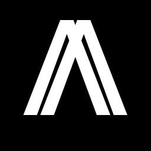
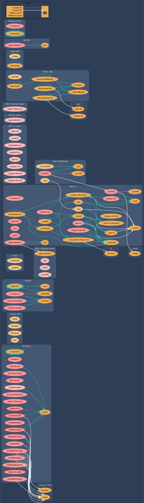
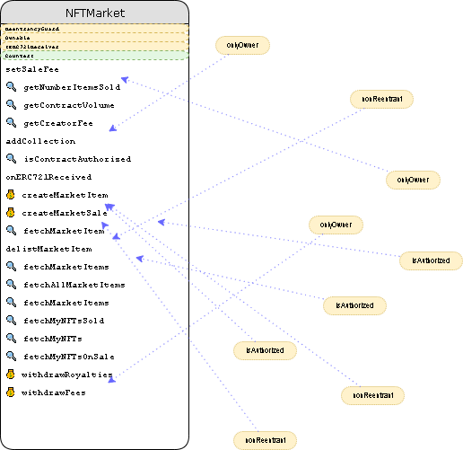

# Agora - Audit Report

## What is Agora ?

Agora is an NFT marketplace built on Arbitrum.

The NFTMarket contract is deployed on *Arbitrum One* mainnet at [0xB6410a1B2d923958a187407844172339051DE999](https://arbiscan.io/address/0xB6410a1B2d923958a187407844172339051DE999)

**Date of the Audit : October 11th, 2021**

### Comments on the Contract 

- 3 Collections are listed : Arbibots, TheBunnyGang and YAYBears.
- Total Volume : 0.85 ETH
- A 2.5% fee is taken by Agora on each sale and an additional variable creator fee. 
- The sale fee cannot be set higher than 2.5%.
- The creator fee doesn't have a maximum.
- The creator and sale fees are stored separately and can be withdrawn at any time.
- Only the creator of a collection can withdraw their fees, only the admin of Agora can withdraw the sale fees.
- The NFTs are stored in the contract like PancakeSwap's Marketplace and not in a peer-to-peer way like OpenSea.

### Ownership Privileges
- The owner can edit the sale fees at any time.
- The owner can withdraw the sale fees at any time.
- The owner can add/edit a collection at any time meaning the creator fee as well as the creator address.
  

### Update

Solidity Finance helped us analyzing the contract. We've found an issue which does not affect our users.

The fees were not reset when withdrawn and therefore could be call indefinitely to withdraw all funds from the contract.

As the product was still early there were no creator fees to redistribute.

Step 1 : Remove the frontend button to prevent any issues.
Step 2 : Redeploy the contract with the bugfix.

Note a proxy wasn't used as our V2 will be slightly different than the V1 and thefore cannot be updated through a proxy.

You can check the Solidity Finance audit on this link : [Solidity Finance](https://solidity.finance/)

---

## Code Structure

### Functions Graph

### Inheritance Graph

### UML Graph

---

## Security Analysis

| Vulnerability  | Result  |
|---|---|
| Reentrancy  | OK |
| Unsafe Delegatecall | OK |
| Insecure source of Randomness | OK |
| Front Running | OK |
| Denial of Service | OK |
| Arithmetic Issues | OK |
| Timestamp Manipulation | OK |
| Secure Fallback Function | OK |
| Design Logic | OK |
| Sensitive Private Data | OK |
| Economy Model | OK |
| Sending Ether Securely | OK |
| Uninitialized Storage Pointers | OK |

## Security Findings

### High Severity

No high severity issues were found.

### Medium Severity

No medium severity issues were found.

### Low Severity

The `MAX_CREATOR_FEE` variable is declared but never used. As the owner of the contract can change the creator fees of any collection at any given time it is recommended that the owner is a multi-sig wallet or a governance (DAO).

-  To Answer this, we are going to soon implement DAgoraO so the owner won't be a single wallet anymore.

The NFTs are stored right in the contract just like `PancakeSwap` NFT marketplace does. Any high severity issue could potentially compromise the NFTs stored.

The frontend could get potentially slower as the `idToMarketItem` mapping gets filled. Although the `fetchMarketItems(address _nftContract)` function helps optimizing that.

---

### Credits

Credits to @tintinweb for his amazing VSCode extensions.
Credits to @naderdabit for his amazing web3 ressources.
Credits to all Agora Supporters 🙌

